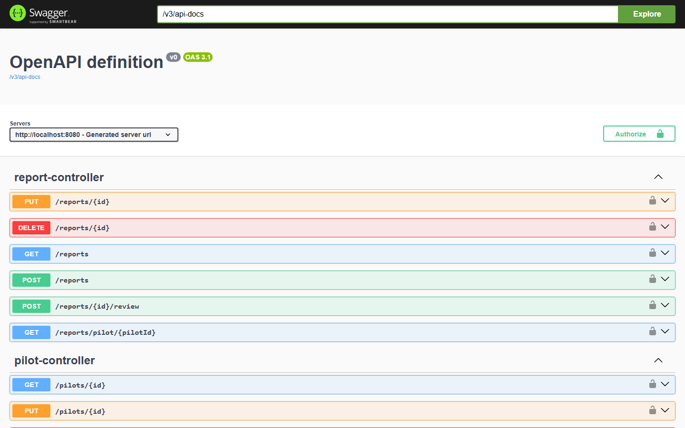
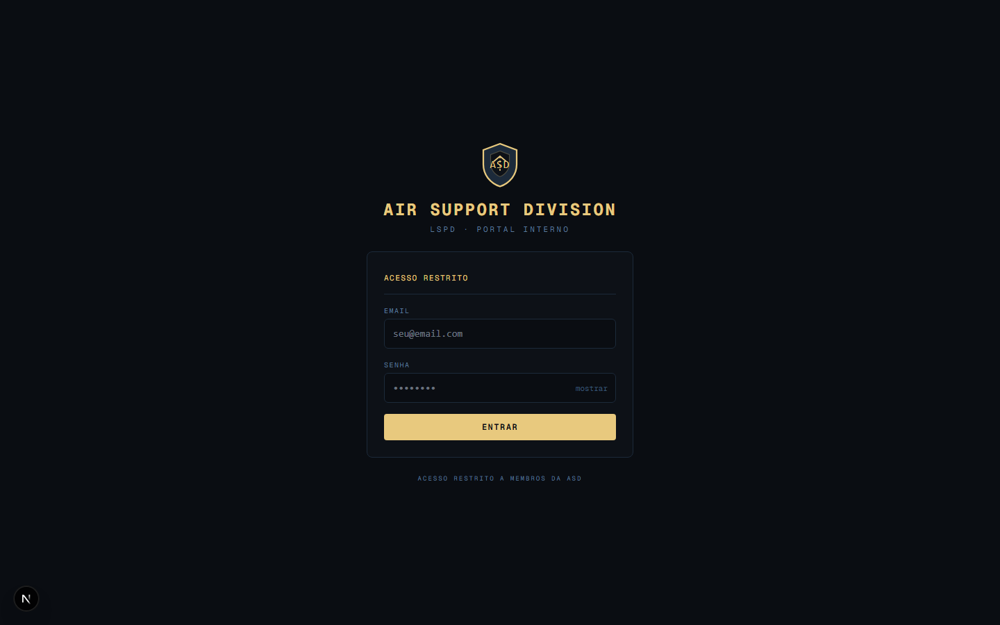

<div align="center">

<h1>Air Ops System — API</h1>

<p>API REST para gestão operacional da unidade aérea <strong>ASD (Air Support Division)</strong> — LSPD · FiveM RP</p>

[](https://openjdk.org/projects/jdk/21/)
[](https://spring.io/projects/spring-boot)
[](https://www.postgresql.org)
[](https://www.docker.com)
[](https://swagger.io)
[](https://render.com)
[](https://github.com/phmacieldev/air-ops-system/actions)

</div>

---

## Preview

| Swagger UI | Portal |
|---|---|
|  |  |

---

## Sobre

O **Air Ops System** é um sistema de gestão operacional construído do zero como projeto de portfólio, resolvendo três problemas reais de uma organização com hierarquia de 8 níveis:

1. **Rastreio de atividade** — cada membro registra protocolos de operação (missão, aeronave, horário), aprovados por líderes.
2. **Progressão por mérito** — relatórios calculam score (`apreensões×5 + perseguições×3 + ops×3 − acidentes×5`) e o rank sobe automaticamente.
3. **Transparência pública** — página `/status` exibe efetivo ativo, horas de voo e taxa de sucesso sem login, com auto-refresh a cada 60s.

> Desenvolvido para a *Air Support Division* (ASD), unidade de apoio aéreo de um servidor FiveM GTA RP com temática policial americana (LSPD). Frontend em Next.js: [phmacieldev/air-ops-system-web](https://github.com/phmacieldev/air-ops-system-web)

| Serviço | URL | Plataforma |
|---|---|---|
| Frontend | https://air-ops-system-web.vercel.app | Vercel |
| Backend API | https://air-ops-system.onrender.com | Render |
| Banco de dados | — | Supabase PostgreSQL |

---

## Funcionalidades

### Autenticação e Conta
- Registro/login com BCrypt + JWT stateless (24h)
- `POST /auth/setup` — cria o primeiro LEAD; retorna 403 se já existirem usuários
- Alteração de e-mail e senha com verificação da senha atual

### Pilotos e Ranks
- CRUD completo de pilotos com perfil próprio (`GET /pilots/me`)
- Hierarquia de 8 ranks com `hierarchyLevel` numérico
- Progressão automática de rank por score acumulado; INSTRUCTOR+ são imunes
- Role ADM — permissões de LEAD, mas **filtrada de toda listagem pública** via JPQL
- Ordenação do roster: score desc → hierarchyLevel desc → callsign asc

### Voos, Relatórios e Certificações
- Protocolos de voo com validação de data/hora futura; tipos: PATRULHA, PURSUIT, BANK, BOOSTING_S, COCAINE_RUN, TREINAMENTO, PATROL
- Relatórios de desempenho com score calculado na aprovação
- Webhook Discord ao aprovar protocolo de voo e ao aprovar relatório (canais configuráveis por variável de ambiente)
- Progressão automática de rank ao aprovar relatório
- Certificações para membros (PURSUIT, OPERATIONAL, SCENE_CONTROL) e externos (COPILOT, TRANSPORT)
- Badges de certificação exibidos no roster

### Infraestrutura
- **Paginação** em voos e relatórios com metadados de navegação
- **Rate limiting** — 10 req/min no login, 100 req/min geral por IP (janela fixa)
- **Health check** enriquecido com uptime e status do banco
- **CORS** configurável por variável de ambiente
- **Flyway** para migrações versionadas
- **Swagger UI** automático via Springdoc
- **CI** com GitHub Actions — build a cada push/PR

---

## Stack

| Camada | Tecnologia |
|---|---|
| Linguagem | Java 21 |
| Framework | Spring Boot 4 + Spring Security 7 |
| Persistência | Spring Data JPA + PostgreSQL 18 |
| Migrations | Flyway |
| Auth | JWT (jjwt 0.13) |
| Documentação | Springdoc OpenAPI 2 (Swagger UI) |
| Build | Maven |
| Containerização | Docker + Docker Compose |
| Deploy | Render (API) + Supabase (banco prod) |
| CI | GitHub Actions |

---

## Hierarquia de Ranks

```
ADM          → permissões iguais ao LEAD; invisível no roster público
LEAD         → acesso total; aprova voos/relatórios; altera ranks
SUPERVISOR   → gerencia roster; aprova relatórios
INSTRUCTOR   → emite certificações; avalia trainees
PILOT_SENIOR → 1000+ pts
PILOT_PLENO  → 600–999 pts
PILOT_STANDARD → 200–599 pts
TRAINEE      → 0–199 pts (protocolo exige aprovação)
```

Progressão automática para ranks com `hierarchyLevel < 5`. INSTRUCTOR, SUPERVISOR e LEAD só mudam por ação manual de um LEAD/ADM.

---

## Arquitetura

```
┌─────────────────────────────────────────────────────────┐
│                     Next.js (Vercel)                    │
│  App Router · TypeScript · Tailwind · Client-side JWT   │
└────────────────────────┬────────────────────────────────┘
                         │ HTTPS
┌────────────────────────▼────────────────────────────────┐
│              Spring Boot 4 REST API (Render)             │
│                                                         │
│  RateLimitFilter → JwtAuthenticationFilter              │
│  Controller → Service → Repository                      │
│                                                         │
│  auth · users · pilots · flights · reports              │
│  certifications · documents · discord · pub             │
└────────────────────────┬────────────────────────────────┘
                         │ JDBC + SSL
┌────────────────────────▼────────────────────────────────┐
│              PostgreSQL (Supabase)                       │
│  Flyway migrations · índices em score/status/role       │
└─────────────────────────────────────────────────────────┘
```

### Decisões de design

**JWT stateless** — O Render free hiberna após 15 min. Com sessões server-side, cada cold start invalidaria todas as sessões ativas. JWT resolve isso: o token é válido independente do estado do servidor.

**`@PreAuthorize` por método** — A regra de acesso fica junto ao método que ela protege, não em um `SecurityConfig` que cresce indefinidamente.

**Flyway com `ddl-auto=update`** — `ddl-auto=update` não recria constraints (ex: `CHECK` em enums PostgreSQL). Flyway garante que o schema em produção seja idêntico ao local.

**Campo `grupo` no backend** — A lógica de grupo não é 1:1 com rank. ADM tem rank LEAD mas grupo "adm". Centralizar em `resolveGrupo()` evita que cada cliente reimplemente a mesma regra de forma inconsistente.

**Filtro de ADM no banco** — O frontend pode ser bypassado. `WHERE user.role != 'ADM'` na query JPQL garante que o ADM nunca apareça em nenhuma listagem, mesmo via chamada direta à API.

---

## API Reference

### Auth
| Método | Rota | Acesso | Descrição |
|---|---|---|---|
| POST | `/auth/setup` | Público | Cria primeiro LEAD. 403 se já existirem usuários |
| POST | `/auth/login` | Público | Retorna JWT |
| POST | `/auth/register` | LEAD/ADM/SUPERVISOR | Cadastra novo membro |
| PATCH | `/auth/email` | Autenticado | Altera e-mail |
| PATCH | `/auth/password` | Autenticado | Altera senha |

### Pilotos
| Método | Rota | Acesso | Descrição |
|---|---|---|---|
| GET | `/pilots` | Autenticado | Lista todos (exclui ADM) |
| GET | `/pilots/me` | Autenticado | Perfil do usuário logado |
| GET | `/pilots/:id` | Autenticado | Perfil completo |
| PUT | `/pilots/:id` | LEAD/ADM/SUPERVISOR | Edita callsign, status e foto |
| PATCH | `/pilots/:id/rank` | LEAD/ADM | Altera rank manualmente |
| PATCH | `/pilots/:id/role` | LEAD/ADM | Altera role |
| PATCH | `/pilots/:id/profile` | Autenticado (próprio) | Edita callsign e foto |
| DELETE | `/pilots/:id` | LEAD/ADM | Remove piloto |

### Voos, Relatórios, Certificações
Documentação interativa completa em `/swagger-ui/index.html`.

---

## Como Rodar Localmente

**Pré-requisitos:** Java 21, Maven, Docker Desktop.

```bash
git clone https://github.com/phmacieldev/air-ops-system
cd air-ops-system

cp .env.example .env
# defaults já funcionam para dev local

mvn spring-boot:run
```

O Spring Boot sobe o container PostgreSQL automaticamente via Docker Compose (`spring.docker.compose.enabled=true`).

Acesse a documentação: `http://localhost:8080/swagger-ui/index.html`

**Primeiro acesso** (banco vazio):

```bash
curl -X POST http://localhost:8080/auth/setup \
  -H "Content-Type: application/json" \
  -d '{"name":"Admin","email":"admin@asd.com","password":"senha123"}'
```

> Se ocorrer erro de `app.jwt.secret not found`, rode `mvn clean compile` antes de subir.

---

## Variáveis de Ambiente

| Variável | Descrição | Padrão local |
|---|---|---|
| `POSTGRES_USER` | Usuário do banco | `postgres` |
| `POSTGRES_PASSWORD` | Senha do banco | `1234` |
| `POSTGRES_DB` | Nome do banco | `air_ops` |
| `JWT_SECRET` | Chave de assinatura JWT (mín. 32 chars) | valor de dev |
| `CORS_ALLOWED_ORIGIN` | URL do frontend permitida pelo CORS | `http://localhost:3000` |
| `DISCORD_WEBHOOK_REPORTS` | Webhook Discord — aprovação de relatórios | opcional |
| `DISCORD_WEBHOOK_FLIGHTS` | Webhook Discord — aprovação de protocolos de voo | opcional |

Em produção (Render), adicionar `DATABASE_URL` com a connection string JDBC do Supabase.

---

## Estrutura de Pacotes

```
com.air_ops_system/
├── auth/           JWT filter, AuthService, DTOs
├── users/          User entity e repositório
├── pilots/         Pilot entity, RankService, progressão automática
├── flights/        FlightLog, FlightService, enums de tipo/aeronave
├── reports/        PerformanceReport, cálculo de score, webhook
├── certifications/ Certification entity e serviço
├── documents/      Document entity e serviço
├── discord/        DiscordWebhookService (silencioso se sem URL)
├── pub/            PublicStatsService (endpoint sem auth)
└── config/         SecurityConfig, RateLimitFilter, OpenApiConfig
```

---

## Próximos Passos

- [ ] Logs estruturados + audit log (tabela `audit_logs` com histórico de ações críticas)
- [ ] Refresh token automático com cookie `httpOnly`
- [ ] Exportar relatórios PDF/CSV
- [ ] Testes unitários e de integração com cobertura mínima de 70%
- [ ] Notificações internas de mudança de status (relatório aprovado/rejeitado)
- [ ] Gráfico de evolução mensal dos KPIs na página `/status`
